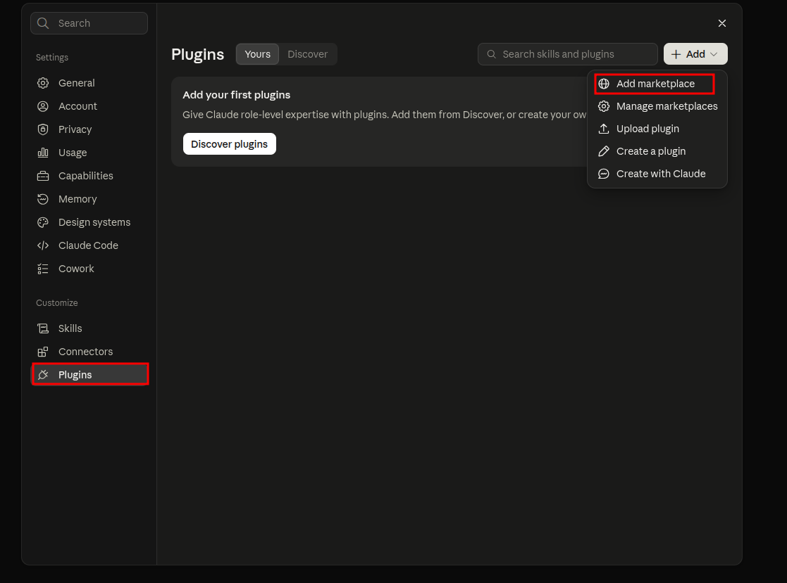
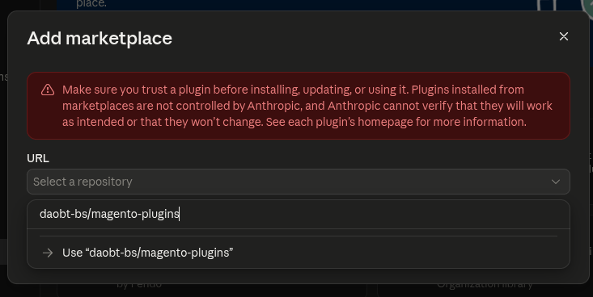
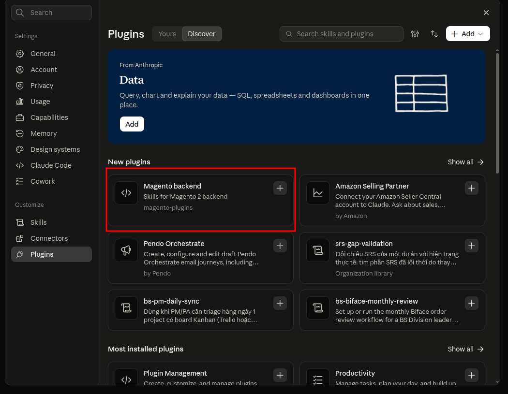

# bs-plugins

Claude Code plugin marketplace for the Magento 2 Dev team.

## Plugins

| Plugin | Description |
|--------|-------------|
| [`magento-backend`](plugins/magento-backend/README.md) | Skills for Magento 2 backend code review, debugging, and security auditing |

## Structure

```
.
├── .claude-plugin/
│   └── marketplace.json                      # Marketplace manifest
├── docs/images/                              # Screenshots used in this README
└── plugins/
    └── magento-backend/
        ├── .claude-plugin/plugin.json        # Plugin manifest
        ├── README.md
        └── skills/
            ├── validate-code/SKILL.md
            ├── debug-code/SKILL.md
            ├── security-audit/SKILL.md
            └── resolve-cache-issue/SKILL.md
```

## Installation

Requires [Claude Code](https://docs.claude.com/en/docs/claude-code) with plugin support.

### Option 1 — Inside Claude Code

Run these slash commands in a Claude Code session:

```
/plugin marketplace add daobt-bs/magento-plugins
/plugin install magento-backend@bs-plugins
```


Then restart Claude Code. Run `/plugin` to confirm the plugin is installed and enabled.

### Option 2 — From the terminal

```bash
claude plugin marketplace add daobt-bs/magento-plugins
claude plugin install magento-backend@bs-plugins
```

By default the plugin is installed for your user (all projects). Use `--scope project` to install it only for the current project, or `--scope local` for the current project without sharing it via the repo.

### Option 3 — Enable for the whole team in a project

Add this to your Magento project's `.claude/settings.json` and commit it. Teammates who trust the project folder are prompted to install the marketplace and plugin automatically:

```json
{
  "extraKnownMarketplaces": {
    "bs-plugins": {
      "source": {
        "source": "github",
        "repo": "daobt-bs/magento-plugins"
      }
    }
  },
  "enabledPlugins": {
    "magento-backend@bs-plugins": true
  }
}
```

### Updating

```bash
claude plugin marketplace update bs-plugins
claude plugin update magento-backend@bs-plugins
```

Restart Claude Code to apply the update.

### Uninstalling

```bash
claude plugin uninstall magento-backend@bs-plugins
claude plugin marketplace remove bs-plugins
```

### Local development

Clone the repo and load the plugin directly without installing:

```bash
git clone https://github.com/daobt-bs/magento-plugins.git
claude --plugin-dir ./magento-plugins/plugins/magento-backend
```

## Using on claude.ai (web)

The `/plugin` commands above are for the Claude Code CLI. On claude.ai you can add this repo as a marketplace from Settings.

### Add the marketplace

1. Open **Settings**, then under **Customize** select **Plugins**.
2. Click **+ Add** (top right) and choose **Add marketplace**.

   

3. In the **URL** field, type `daobt-bs/magento-plugins` and select **Use "daobt-bs/magento-plugins"**, then confirm.

   

4. Switch to the **Discover** tab. **Magento backend** appears under **New plugins** (or search for it). Click **+** on the card to install it.

   

To pick up a newer version after the repo is updated, open **+ Add > Manage marketplaces** and update the `magento-plugins` marketplace.

### Claude Code on the web

Claude Code on the web (claude.ai/code) runs on your repository, so use [Option 3](#option-3--enable-for-the-whole-team-in-a-project): commit the `extraKnownMarketplaces` / `enabledPlugins` block to the Magento project's `.claude/settings.json`.

## Using with other AI tools

Each skill is a plain `SKILL.md` file following the open [Agent Skills](https://agentskills.io) format, so it isn't tied to Claude Code. Only the marketplace/plugin packaging (`marketplace.json`, `plugin.json`, `/plugin install`) is Claude Code-specific.

### Tools that support Agent Skills

Copy the skill folders into the skills directory your tool reads. The agent picks a skill automatically based on its `description`.

```bash
git clone https://github.com/daobt-bs/magento-plugins.git
mkdir -p .agents/skills
cp -r magento-plugins/plugins/magento-backend/skills/* .agents/skills/
```

Common locations (project-level; most tools also have a user-level equivalent under `~/`):

| Tool | Skills directory |
|------|------------------|
| Cross-tool (portable) | `.agents/skills/` |
| OpenAI Codex | `.codex/skills/` |
| GitHub Copilot | `.github/skills/` |
| Cursor | `.cursor/skills/` |
| Gemini CLI | `.gemini/skills/` |

Supported paths change between versions — check your tool's documentation if a skill isn't picked up.

### Any other LLM

For tools without skill support (ChatGPT, Gemini web, local models, ...), paste the content of the relevant `SKILL.md` into the system prompt or at the start of the conversation, then describe your task. The skill won't trigger automatically, so choose it yourself:

| Task | Skill file |
|------|-----------|
| Review a PR / module / file | [`validate-code/SKILL.md`](plugins/magento-backend/skills/validate-code/SKILL.md) |
| Debug an error or symptom | [`debug-code/SKILL.md`](plugins/magento-backend/skills/debug-code/SKILL.md) |
| Security audit | [`security-audit/SKILL.md`](plugins/magento-backend/skills/security-audit/SKILL.md) |
| Investigate stale content or cache behavior | [`resolve-cache-issue/SKILL.md`](plugins/magento-backend/skills/resolve-cache-issue/SKILL.md) |

## Adding a new plugin

1. Create `plugins/<plugin-name>/.claude-plugin/plugin.json` and add its skills under `plugins/<plugin-name>/skills/`.
2. Register it in `.claude-plugin/marketplace.json`:
   ```json
   {
     "name": "<plugin-name>",
     "source": "./plugins/<plugin-name>",
     "description": "..."
   }
   ```
3. Add a row to the Plugins table above.
4. Run `claude plugin validate .` to check the manifests.
