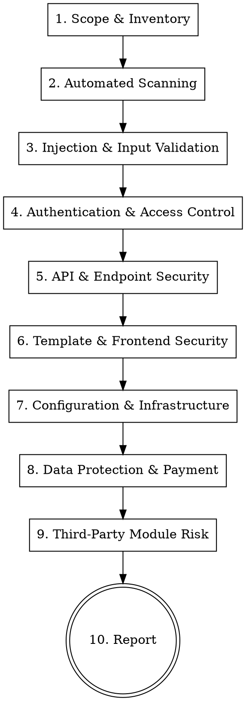

# Magento 2 Security Audit

## Overview

Systematic security audit for Magento 2 codebases. Goes beyond single-file review (see `validate-magento-backend-code` for PR-level checks) to assess the **entire attack surface**: custom modules, third-party extensions, configuration, API endpoints, admin controllers, payment flows, and infrastructure settings.

**Core principle:** Attackers don't review one file at a time — they scan for patterns across the whole codebase. This skill does the same.

## When to Use

- Full security audit of the codebase or a module set
- Pre-deployment security review
- Reviewing third-party extensions before installation
- Post-incident investigation (looking for similar vulnerabilities)
- Compliance check (PCI DSS, GDPR data handling)
- NOT for single-file or PR-level review — use `validate-magento-backend-code` for that

## Audit Workflow



---

## Phase 0: Identify Project Context

Before anything else, determine the project's custom vendor namespace(s) and structure.

```bash
# List all vendor namespaces under app/code/
ls app/code/

# Identify which are custom (project-specific) vs third-party
# Custom namespaces are typically: Custom, Client, Company, etc.
# Third-party: Amasty, Magenest, Olegnax, Bss, Mirasvit, Aheadworks, etc.

# Check Magento version
composer show magento/product-community-edition 2>/dev/null || composer show magento/product-enterprise-edition 2>/dev/null

# Check PHP version
php -v | head -1
```

Throughout this skill, `{CustomVendor}` refers to the project's own namespace(s). Replace with the actual vendor name(s) identified above (e.g., `Custom`, `MyCompany`). When scanning for security issues, audit **all** code under `app/code/` — both custom and third-party.

---

## Phase 1: Scope & Inventory

Before scanning, understand what you're auditing.

```bash
# List all custom modules
ls app/code/

# List enabled modules
php bin/magento module:status --enabled

# List all routes (frontend + admin)
grep -r "frontName" app/code/*/etc/*/routes.xml

# List all REST API endpoints
grep -rn "interface.*RepositoryInterface" app/code/ --include="*.php"
grep -rn "<route " app/code/*/etc/webapi.xml

# List all GraphQL schemas
find app/code/ -name "schema.graphqls" -type f

# List all admin controllers
find app/code/ -path "*/Controller/Adminhtml/*.php" -type f

# List all observers
grep -rn "<observer " app/code/*/etc/events.xml app/code/*/etc/*/events.xml

# List all plugins
grep -rn '<plugin ' app/code/*/etc/di.xml app/code/*/etc/*/di.xml

# List all cron jobs
grep -rn "<job " app/code/*/etc/crontab.xml
```

**Deliverable:** Module inventory table — module name, type (custom/third-party), area (frontend/admin/API), risk level (high if handles user input, payments, or admin actions).

---

## Phase 2: Automated Scanning

Run automated tools first to catch low-hanging fruit before manual review.

```bash
# Identify custom vendor namespace(s) — scan target for audit
# Look at app/code/ to find all vendor namespaces, then determine which are custom vs third-party
CUSTOM_VENDORS=$(ls app/code/ | head -20)  # review and pick the project's own namespace(s)

# Magento coding standard (includes security sniffs) — target custom modules
vendor/bin/phpcs --standard=Magento2 --severity=1 app/code/{CustomVendor}/

# PHPStan static analysis — target custom modules
# Adjust -c path if project uses a custom phpstan.neon
vendor/bin/phpstan analyse app/code/{CustomVendor}/ -c dev/tests/static/testsuite/Magento/Test/Php/_files/phpstan/phpstan.neon

# Search for known dangerous functions across codebase
grep -rn "unserialize\s*(" app/code/ --include="*.php"
grep -rn "eval\s*(" app/code/ --include="*.php"
grep -rn "exec\s*(\|shell_exec\s*(\|passthru\s*(\|system\s*(\|popen\s*(" app/code/ --include="*.php"
grep -rn "file_get_contents\s*(\|file_put_contents\s*(" app/code/ --include="*.php"
grep -rn "preg_replace\s*.*\/.*e" app/code/ --include="*.php"
grep -rn "assert\s*(" app/code/ --include="*.php"
grep -rn "include\s*\$\|require\s*\$" app/code/ --include="*.php"

# Search for hardcoded credentials
grep -rn "password\s*=\s*['\"]" app/code/ --include="*.php"
grep -rn "api_key\s*=\s*['\"]" app/code/ --include="*.php"
grep -rn "secret\s*=\s*['\"]" app/code/ --include="*.php"
grep -rn "token\s*=\s*['\"]" app/code/ --include="*.php"
```

**Deliverable:** List of automated findings, filtered for false positives.

---

## Phase 3: Injection & Input Validation (CRITICAL)

The highest-impact vulnerability class. Check every path where user input reaches a sink.

### 3.1 SQL Injection

| Pattern | Severity | Search |
|---------|----------|--------|
| Raw string in query | CRITICAL | `grep -rn '\$connection->query\|->fetchAll\|->fetchRow\|->fetchOne\|->fetchCol\|->fetchPairs' app/code/ --include="*.php"` |
| String concat in where | CRITICAL | `grep -rn "->where\s*(" app/code/ --include="*.php"` — check for `$variable` inside string |
| Raw expression | HIGH | `grep -rn "new \\\Zend_Db_Expr\|new Expression\|Zend_Db_Expr(" app/code/ --include="*.php"` |
| addFieldToFilter with raw | HIGH | Look for user input passed directly to `addFieldToFilter` without type cast |

**What to look for:**
```php
// VULNERABLE - string concatenation
$connection->query("SELECT * FROM table WHERE id = " . $id);
$collection->getSelect()->where("entity_id = $id");

// SAFE - bound parameters
$connection->query("SELECT * FROM table WHERE id = ?", [$id]);
$collection->addFieldToFilter('entity_id', (int)$id);
```

### 3.2 Command Injection

| Pattern | Severity | Search |
|---------|----------|--------|
| Shell execution with user input | CRITICAL | `grep -rn 'exec(\|shell_exec(\|system(\|passthru(\|popen(\|proc_open(' app/code/ --include="*.php"` |
| Unescaped arguments | CRITICAL | Any `escapeshellarg()`/`escapeshellcmd()` missing when user input is in command |

### 3.3 Path Traversal / File Inclusion

| Pattern | Severity | Search |
|---------|----------|--------|
| User-controlled file paths | CRITICAL | `grep -rn 'file_get_contents\|fopen\|readfile\|include\|require' app/code/ --include="*.php"` — trace if `$_GET`/`$_POST`/`getParam()` flows into path |
| File upload without validation | HIGH | `grep -rn "getParam.*file\|getTmpName\|move_uploaded_file\|moveTo" app/code/ --include="*.php"` |
| Missing extension whitelist | HIGH | Uploaded files must validate extension AND MIME type |

**What to look for:**
```php
// VULNERABLE - user-controlled path
$file = $this->getRequest()->getParam('file');
$content = file_get_contents($dir . '/' . $file); // path traversal: ../../etc/passwd

// SAFE - validate against allowed paths
$realPath = realpath($dir . '/' . $file);
if (strpos($realPath, $allowedDir) !== 0) { throw ... }
```

### 3.4 Insecure Deserialization

| Pattern | Severity | Search |
|---------|----------|--------|
| Native unserialize | CRITICAL | `grep -rn 'unserialize(' app/code/ --include="*.php"` |
| JSON decode without validation | MEDIUM | `grep -rn 'json_decode(' app/code/ --include="*.php"` — check if result is validated before use |

**Fix:** Always use `Magento\Framework\Serialize\SerializerInterface` (defaults to JSON). Never use PHP's native `unserialize()`.

### 3.5 LDAP / XML / Header Injection

| Pattern | Severity | Search |
|---------|----------|--------|
| XML External Entity (XXE) | HIGH | `grep -rn 'simplexml_load_string\|DOMDocument\|loadXML\|SimpleXMLElement' app/code/ --include="*.php"` — check if `libxml_disable_entity_loader` is called |
| Header injection | HIGH | `grep -rn 'header(\|setHeader\|redirect(' app/code/ --include="*.php"` — check for user input in headers |
| SSRF | HIGH | `grep -rn 'curl_exec\|file_get_contents\|Curl\|HttpClient' app/code/ --include="*.php"` — check if URL is user-controlled |

---

## Phase 4: Authentication & Access Control

### 4.1 Admin Controllers

```bash
# Find admin controllers WITHOUT ADMIN_RESOURCE
find app/code/ -path "*/Controller/Adminhtml/*.php" -exec grep -L "ADMIN_RESOURCE" {} \;

# Find admin controllers — verify each has matching acl.xml entry
grep -rn "ADMIN_RESOURCE" app/code/*/Controller/Adminhtml/*.php
```

| Check | Severity | What to look for |
|-------|----------|------------------|
| Missing `ADMIN_RESOURCE` | CRITICAL | Admin controller without ACL constant — anyone with admin login can access |
| Overly broad ACL | HIGH | `ADMIN_RESOURCE = 'Magento_Backend::admin'` — grants access to ALL admins, should be scoped |
| Missing `_isAllowed()` | HIGH | Custom permission logic not implemented where controller needs finer control |
| ACL entries without controllers | LOW | Orphan ACL entries in `acl.xml` — cleanup, not a vuln |

### 4.2 Frontend Controllers

```bash
# Find POST controllers without CSRF protection
find app/code/ -path "*/Controller/*.php" -exec grep -L "CsrfAwareActionInterface\|FormKeyValidator\|_validateFormKey\|form_key" {} \;
```

| Check | Severity | What to look for |
|-------|----------|------------------|
| Missing CSRF protection | HIGH | POST endpoint without `CsrfAwareActionInterface` or form-key validation |
| Missing customer session check | HIGH | Customer-area controller that doesn't verify `customer/session` is logged in |
| Open redirect | MEDIUM | `redirect($this->getRequest()->getParam('url'))` — redirect to attacker-controlled URL |

### 4.3 Session & Cookie Security

| Check | Severity | What to look for |
|-------|----------|------------------|
| Session fixation | HIGH | Session ID not regenerated after login — check `session.use_strict_mode` |
| Cookie flags | MEDIUM | `Secure`, `HttpOnly`, `SameSite` flags in `env.php` session config |
| Session storage | MEDIUM | File-based sessions in shared hosting — prefer Redis/DB |

---

## Phase 5: API & Endpoint Security

### 5.1 REST API (`webapi.xml`)

```bash
# List all REST endpoints and their auth
grep -rn '<route ' app/code/*/etc/webapi.xml
grep -rn 'resource=' app/code/*/etc/webapi.xml
```

| Check | Severity | What to look for |
|-------|----------|------------------|
| `resource="anonymous"` | CRITICAL | Public API endpoint — verify it should truly be public, check for data exposure |
| `resource="self"` | MEDIUM | Customer-scoped — verify it doesn't leak other customers' data |
| Missing rate limiting | MEDIUM | Public endpoints without rate limiting — DoS risk |
| Excessive data in response | MEDIUM | API returning full entity (including internal fields) instead of DTO |

### 5.2 GraphQL

```bash
# Find all GraphQL resolvers
find app/code/ -name "schema.graphqls" -exec grep -l "type " {} \;
find app/code/ -path "*/Model/Resolver/*.php" -type f
```

| Check | Severity | What to look for |
|-------|----------|------------------|
| Missing auth on mutation | CRITICAL | Mutation resolver without `$context->getExtensionAttributes()->getIsCustomer()` check |
| Query depth/complexity | HIGH | No query complexity limits — allows resource-exhaustion attacks |
| Introspection in production | MEDIUM | `graphql/introspection` should be disabled in production |

---

## Phase 6: Template & Frontend Security

### 6.1 XSS (Cross-Site Scripting)

```bash
# Find raw echo in templates
grep -rn 'echo \$\|<?= \$' app/code/ --include="*.phtml" | grep -v 'escapeHtml\|escapeUrl\|escapeJs\|escapeQuote\|escapeCss\|escapeHtmlAttr'

# Find raw output in blocks
grep -rn 'echo \$\|return .*\$.*getParam\|return .*\$.*getRequest' app/code/*/Block/ --include="*.php"
```

| Context | Required escape | Common mistake |
|---------|----------------|----------------|
| HTML body | `$block->escapeHtml($value)` | Raw `echo $value` |
| HTML attribute | `$block->escapeHtmlAttr($value)` | `value="<?= $value ?>"` |
| URL | `$block->escapeUrl($value)` | `href="<?= $url ?>"` |
| JavaScript | `$block->escapeJs($value)` | Inline `<script>var x = '<?= $value ?>'</script>` |
| CSS | `$block->escapeCss($value)` | `style="color: <?= $value ?>"` |

### 6.2 Content Security Policy

| Check | Severity | What to look for |
|-------|----------|------------------|
| Inline scripts | MEDIUM | `<script>` tags in `.phtml` — should use RequireJS modules |
| `unsafe-inline` / `unsafe-eval` | MEDIUM | CSP headers allowing inline scripts |
| External resource loading | LOW | Scripts/styles loaded from CDN without SRI hash |

### 6.3 Knockout.js / UI Component Security

| Check | Severity | What to look for |
|---------|----------|------------------|
| `html` binding with user data | HIGH | `data-bind="html: userInput"` — renders raw HTML, XSS risk |
| `attr` binding with URLs | MEDIUM | User-controlled URLs in `attr: { href: userUrl }` — open redirect |
| `afterRender` with eval | HIGH | Dynamic code execution in UI components |

---

## Phase 7: Configuration & Infrastructure

### 7.1 `env.php` Audit

| Setting | Secure value | Risk if wrong |
|---------|-------------|---------------|
| `'mode' => 'production'` | `production` | Developer mode shows stack traces to users |
| `'db.connection.default.password'` | Strong, unique | Weak DB password |
| `'crypt.key'` | Random 32+ chars | Weak encryption key — all encrypted config compromised |
| `'session.save'` | `redis` or `db` | `files` is vulnerable on shared hosting |
| `'x-frame-options'` | `SAMEORIGIN` | Clickjacking if missing |
| `'cache.frontend.default.backend'` | `Cm_Cache_Backend_Redis` | File cache in shared env = cache poisoning risk |

### 7.2 Web Server Configuration

| Check | Severity | What to look for |
|-------|----------|------------------|
| `pub/` as document root | HIGH | Non-pub root exposes `app/`, `var/`, `dev/` |
| Directory listing disabled | HIGH | `autoindex off` (nginx) / `Options -Indexes` (Apache) |
| `.htaccess` / `nginx.conf` | HIGH | Deny access to `app/`, `var/`, `dev/`, `lib/`, `setup/` |
| HTTPS enforcement | HIGH | All pages must redirect HTTP → HTTPS |
| Security headers | MEDIUM | `X-Content-Type-Options`, `X-XSS-Protection`, `Strict-Transport-Security` |
| PHP info exposure | MEDIUM | `phpinfo()` accessible, `expose_php = On` |

### 7.3 File Permissions

```bash
# Check for world-writable files (should be none)
find app/code/ -perm -002 -type f

# Check for executable PHP files (unusual)
find app/code/ -name "*.php" -perm -111 -type f

# Sensitive files should not be web-accessible
# Verify .htaccess blocks access to: app/etc/env.php, composer.json, composer.lock, auth.json
```

### 7.4 Debug & Development Artifacts

```bash
# Left-behind debug code
grep -rn "var_dump\|print_r\|debug_backtrace\|exit(\|die(" app/code/ --include="*.php"

# Test/debug endpoints
grep -rn "phpinfo\|xdebug_break\|Xdebug" app/code/ --include="*.php"

# Log statements that might expose sensitive data
grep -rn "->debug(\|->info(\|->log(" app/code/ --include="*.php" | grep -i "password\|token\|secret\|credit\|card\|ssn"
```

---

## Phase 8: Data Protection & Payment Security

### 8.1 Sensitive Data Handling

| Check | Severity | What to look for |
|-------|----------|------------------|
| PII in logs | CRITICAL | Customer email, phone, address logged in plain text |
| Credit card data stored | CRITICAL | Card numbers stored anywhere outside PCI-compliant vault |
| Passwords in plain text | CRITICAL | `grep -rn "password" app/code/ --include="*.php"` — check if hashed before storage |
| Data in URL parameters | HIGH | Sensitive data in GET params (appears in logs, browser history) |
| Missing data encryption | HIGH | Sensitive config values not using `backend_model="Magento\Config\Model\Config\Backend\Encrypted"` |

### 8.2 Payment Module Security

| Check | Severity | What to look for |
|-------|----------|------------------|
| Card data in server logs | CRITICAL | Payment data logged during processing |
| Card data in session | CRITICAL | CC data stored in PHP session |
| Payment redirect tampering | HIGH | Return URL from payment gateway not validated |
| Order amount manipulation | HIGH | Amount sent to gateway not re-verified server-side |
| Payment method switching | MEDIUM | Customer can switch to a cheaper/free method after checkout |

### 8.3 GDPR / Data Privacy

| Check | Severity | What to look for |
|-------|----------|------------------|
| Data export capability | MEDIUM | Can customer export their data? (Magento 2.4+ has built-in) |
| Data deletion | MEDIUM | Can customer request deletion? |
| Consent tracking | MEDIUM | Cookie consent, marketing opt-in tracked properly |
| Third-party data sharing | HIGH | Customer data sent to external services without consent |

---

## Phase 9: Third-Party Module Risk Assessment

Third-party modules are the #1 source of Magento vulnerabilities.

### Assessment Checklist Per Module

```bash
# List all non-Magento vendors in app/code/
# Filter out the project's own custom namespace(s) to isolate third-party modules
ls app/code/ | grep -v "Magento"
# Then exclude your project's custom vendor(s) from the list to get third-party only

# For each vendor, check:
# 1. Known vulnerabilities
# 2. Code quality indicators
# 3. Dangerous patterns
```

| Check | Severity | What to look for |
|-------|----------|------------------|
| Known CVEs | CRITICAL | Search vendor+module on sansec.io, mageone.com, Adobe security bulletins |
| `ObjectManager::getInstance()` | HIGH | Direct container access — bypasses DI, sign of low-quality code |
| Raw SQL queries | HIGH | `$connection->query()` with string concatenation |
| `eval()` / `unserialize()` | CRITICAL | Remote code execution risk |
| Outbound HTTP calls | MEDIUM | Module phoning home, license checks — potential data leak |
| File system writes | MEDIUM | Module writing to non-standard paths |
| Admin-only or blanket ACL | HIGH | `Magento_Backend::admin` instead of scoped resource |
| Obfuscated code | CRITICAL | `base64_decode`, `gzinflate`, `str_rot13` — likely backdoor or at minimum unauditable |

### Known Risky Patterns in Third-Party Modules

```bash
# Obfuscated / encoded code (potential backdoor)
grep -rn "base64_decode\|gzinflate\|gzuncompress\|str_rot13\|gzdeflate" app/code/ --include="*.php" | grep -v vendor/ | grep -v Test/

# License-check / phone-home calls
grep -rn "curl_exec\|file_get_contents('http" app/code/ --include="*.php"

# Dynamic class instantiation (potential RCE)
grep -rn "new \$\|call_user_func\|call_user_func_array" app/code/ --include="*.php"
```

---

## Phase 10: Report Template

```markdown
# Security Audit Report — [Project Name]

**Date:** YYYY-MM-DD
**Auditor:** [name]
**Scope:** [modules/areas audited]
**Magento Version:** [version]
**PHP Version:** [version]

## Executive Summary
- Total findings: X critical, Y high, Z medium, W low
- Top risk areas: [...]
- Immediate action required: [yes/no]

## Critical Findings (fix immediately)
### [CRIT-001] Title
- **Location:** `file:line`
- **Category:** [SQLi / XSS / ACL / RCE / ...]
- **Description:** What's wrong
- **Impact:** What an attacker can do
- **Proof of concept:** Steps to reproduce (if safe to include)
- **Remediation:** Exact fix with code example
- **CVSS estimate:** [score]

## High Findings (fix before next deploy)
### [HIGH-001] Title
(same structure)

## Medium Findings (fix in next sprint)
### [MED-001] Title
(same structure)

## Low Findings (track in backlog)
### [LOW-001] Title
(same structure)

## Configuration Hardening Recommendations
(non-code changes: env.php, web server, PHP settings)

## Third-Party Module Risk Matrix
| Module | Vendor | Version | Known CVEs | Code Quality | Risk Level | Recommendation |
|--------|--------|---------|------------|-------------|------------|----------------|

## Appendix
- Automated scan results (phpcs, phpstan output)
- Full list of endpoints audited
- Methodology notes
```

---

## Quick-Scan Mode

For a fast security pass (30 min instead of full audit), run only these high-signal searches:

```bash
# 1. SQL injection (highest real-world impact)
grep -rn '\$connection->query\|->fetchAll\|->fetchRow' app/code/ --include="*.php" | grep -v "bind\|?\|placeholder"

# 2. XSS in templates
grep -rn '<?= \$' app/code/ --include="*.phtml" | grep -v 'escape'

# 3. Missing ACL on admin controllers
find app/code/ -path "*/Controller/Adminhtml/*.php" -exec grep -L "ADMIN_RESOURCE" {} \;

# 4. Dangerous functions
grep -rn 'unserialize\|eval\|exec(\|shell_exec\|system(\|passthru(' app/code/ --include="*.php"

# 5. Hardcoded secrets
grep -rn "password.*=.*['\"][^'\"]\+['\"]" app/code/ --include="*.php" | grep -v "getParam\|Config\|label\|comment\|placeholder\|type\|__("

# 6. Obfuscated code (backdoor indicator)
grep -rn "base64_decode\|gzinflate\|str_rot13" app/code/ --include="*.php"

# 7. Missing CSRF protection
find app/code/ -path "*/Controller/*.php" -exec grep -l "execute.*POST\|getRequest.*getPost" {} \; | xargs grep -L "CsrfAwareActionInterface\|FormKeyValidator"

# 8. Debug artifacts
grep -rn "var_dump\|phpinfo\|print_r" app/code/ --include="*.php" --include="*.phtml"
```

---

## Common Mistakes When Auditing

- **Ignoring third-party modules** — they're often lower quality than custom code and are the most common attack vector in Magento breaches
- **Only checking PHP** — JavaScript (especially Knockout bindings with `html:`) and configuration files are also attack surfaces
- **Trusting `escapeHtml` everywhere** — wrong escape function for context (URL in `escapeHtml` instead of `escapeUrl`) is still vulnerable
- **Missing indirect SQL injection** — user input flows through 3+ method calls before reaching a query; trace the full data flow
- **Skipping API endpoints** — REST/GraphQL endpoints with `resource="anonymous"` are public and frequently overlooked
- **Not checking cron jobs** — cron handlers that process user-uploaded files or external data are a classic entry point
- **Assuming Magento core is safe** — check patches are applied: `composer show magento/product-community-edition` or `composer show magento/product-enterprise-edition` and compare against Adobe Security Bulletins
